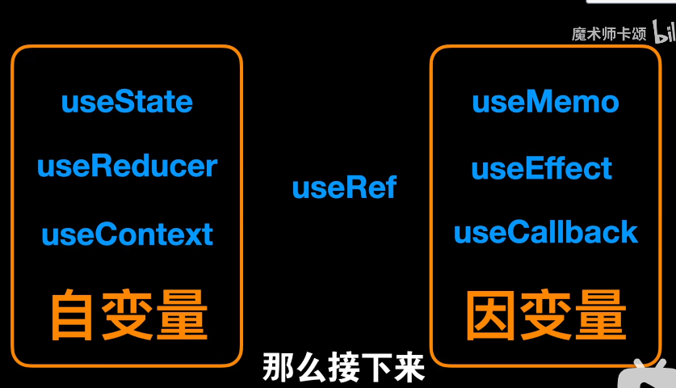

# React Hooks



## useState

## useEffect

- 可以写多个useEffect。

- ```js
  useEffect 在每次render之后执行
  useEffect(() => {}, []) ==>  componentDidMount
  useEffect(() => {}, [deps1]) ==> componentDidUpdate
  useEffect(() => { return }, []) ==> componentWillUnmount
  ```

- 该组件需要实现组件卸载时清除定时器，同时某变量变化时，需要做一些操作。

### 闭包陷阱

- 定时器

## useContext

- 怎么传多个变量，传数组

## useReducer

- useContext共享状态；useReducer处理逻辑 =》实现Redux效果    demo6